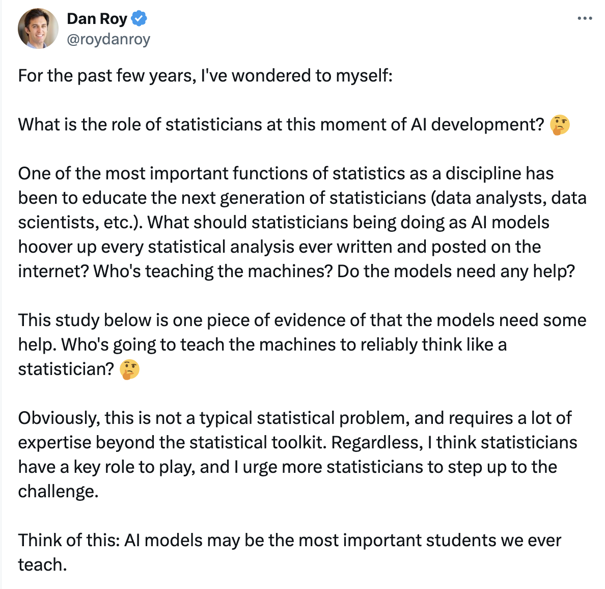

# About

## About This Project

Codex Batman is a Codex-native toolkit for building cleaner, more reproducible data science workflows.

This page explains who I am, why this site exists, and what kind of system I am trying to build in public.

The goal is to build in public a resource for data science students, data scientists, and data science
managers to leverage AI to improve their learning, their workflows, and their project management skills
respectively. It's inspired by Dan Roy's post about the role of statisticians at this moment in AI
development. I don't think AI models are the most important students I'll ever teach, but I do think
that avoiding this topic (or pretending to address it while just continuing to prove minimax and
efficient influence function theory...) is the wrong approach. This site is my first attempt to
**step up to the challenge.**

**Dan Roy on X**

This site is intentionally hands-on and iterative. It is meant to evolve in public.

---

## Who I Am

I am [Walter Dempsey](https://walterhdempsey.com), an academic statistician and applied methodologist trying to make AI genuinely useful for disciplined analytical work.

## About [Walter Dempsey](https://walterhdempsey.com)

I am an Associate Professor of [Biostatistics](https://sph.umich.edu/biostat/) and an Assistant Research
Professor in [d3lab](https://d3lab-isr.com) in the [Institute for Social Research](https://isr.umich.edu)
at the [University of Michigan](https://umich.edu).

Outside of statistics, I raise two amazing kids with my wife, hang out with my beagle, and am an avid
soccer fan (COYG).

While I do code in R and Python, I have 0 front-end experience. Everything on this site was built with
AI tools and human inspirations.

Education and training highlights:

- PhD, Department of Statistics, University of Chicago
- Postdoctoral Research Fellow, Department of Statistics, University of Michigan
- Postdoctoral Research Fellow, Department of Statistics, Harvard University

You can find publications and additional background on
[Google Scholar](https://scholar.google.com) and the [Dempsey Lab site](https://wdempsey.netlify.app/index.html).

- Website: [walterhdempsey.com](https://walterhdempsey.com)
- Digital Garden: Link to come
- Social: [@wdempsey on X/Twitter](https://x.com/wdempsey)

---

## How I Got Here

This project started from a simple tension: high-quality data science work requires structure,
but day-to-day execution often drifts toward ad hoc scripts and fragmented notes.

Codex made it possible to encode process directly into workflow scaffolding. The focus here is not
just speed. The focus is better decisions, clearer assumptions, and reusable outputs.

### Why This Site Exists

The aim is to share a working system in progress:

- how to plan analysis before coding,
- how to keep experiments reproducible,
- how to document what changed and why,
- how to hand off models and decisions cleanly.

### What Will Be Added Next

- More worked examples from real projects
- Better templates for common data science tasks
- Notes, essays, and lessons learned from ongoing use

---

## How This Site Was Built

This site is built with [MkDocs Material](https://squidfunk.github.io/mkdocs-material/), hosted on
[GitHub Pages](https://pages.github.com/), and maintained as a lightweight docs-first codebase.

Source code: [github.com/wdempsey/codexbatman](https://github.com/wdempsey/codexbatman)

License: MIT

---

## Contact and Feedback

- Quick feedback on any page: [Email me](mailto:codexbatman+feedback@gmail.com)
- Bug reports or corrections: [GitHub Issues](https://github.com/wdempsey/codexbatman/issues)
- Discussion and questions: [GitHub Discussions](https://github.com/wdempsey/codexbatman/discussions)
- Research inquiries: See [walterhdempsey.com](https://walterhdempsey.com)

---

## Acknowledgments

This project builds on open documentation patterns and workflow examples shared by the broader AI and
data science community.

Special thanks to [Claude Blattman](https://claudeblattman.com/) for the original site structure that
inspired this fork.

Special thanks to the reference implementations that influenced this system — credited on the
[Resources page](resources.md).

Thanks to my sabbatical for giving me the hours to help understand these tools, and to Codex team at
OpenAI for building a useful product.
