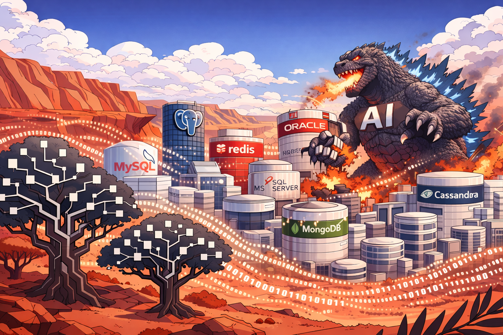

---
hide:
  - navigation
  - toc
description: Codex-native data science workflow system with structured workflow gates, reproducibility enforcement, and role-aware overlays.
social:
  cards_layout_options:
    title: Codex-Native Data Science Workflow
    description: Structured, reproducible workflow for disciplined applied data science.
---

  <section class="hf-section hf-hero" id="home-intro">
    

    

      <h1>Codex-Native Data Science Workflow</h1>
      

        Codex Batman is a markdown-first, artifact-first operating system for reproducible data science. It gives
        students, practitioners, and managers one shared workflow backbone with clear gates, durable project memory,
        and role-aware execution.
      

      

        <a class="md-button md-button--primary" href="quickstart/">Start with Quickstart</a>
        <a class="md-button" href="roles/">Choose your role</a>
      

    

    
Scroll

  </section>

  <section class="hf-section hf-section--dark" id="choose-your-path">
    

      
Choose Your Path

      <h2>Start From The Role You Actually Have</h2>
      

        Students, researchers, data scientists, and managers all use the same workflow backbone. The role paths change
        the delivery style and first action so you do not have to learn the whole architecture before getting started.
      

      

        <article class="hf-bubble">
          <h3>Students</h3>
          
Learn through guided practice, hints, and attempt-before-answer tutoring.

          
<a href="students/">Open student path</a>

        </article>
        <article class="hf-bubble">
          <h3>Researchers & Data Scientists</h3>
          
Run trustworthy analysis with gates, artifacts, and reproducible project memory.

          
<a href="data-scientists/">Open research path</a>

        </article>
        <article class="hf-bubble">
          <h3>Managers</h3>
          
Track project health, blockers, handoffs, decisions, and stakeholder updates.

          
<a href="managers/">Open manager path</a>

        </article>
      

      

        <a class="md-button md-button--primary" href="roles/">Compare role paths</a>
        <a class="md-button" href="examples/">See worked examples</a>
      

    

  </section>

  <section class="hf-section" id="how-it-works">
    

      
How It Works

      <h2>One Backbone, Different Lenses</h2>
      

        Skills encode best practices, documentation pages explain the workflows, and role overlays adapt the same
        backbone to learning, execution, and management.
      

      

        <article class="hf-media-row hf-reveal">
          

            
          

          

            <h3>Installation and Setup</h3>
            
Set up the base toolkit, environment, and local workflow checks.

            
<a href="setup/">Open setup</a>

          

        </article>

        <article class="hf-media-row hf-media-row--alt hf-reveal">
          

            
          

          

            <h3>Workflow Backbone</h3>
            
Move from project bootstrap through problem framing, data audit, modeling, evaluation, and experiment logging.

            
<a href="workflows/data-science/">Open workflow overview</a>

          

        </article>

        <article class="hf-media-row hf-reveal">
          

            
          

          

            <h3>Worked Examples</h3>
            
See the same system through learning, execution, and manager coordination lenses.

            
<a href="examples/">Open examples</a>

          

        </article>
      

      

        <a class="md-button" href="quickstart/">Open the guided quickstart</a>
        <a class="md-button" href="backbone/">Explore the Backbone Protocol</a>
      

    

  </section>

  <section class="hf-section hf-section--dark" id="proof-of-utility">
    

      
Proof Of Utility

      <h2>What The System Produces</h2>
      

        The point is not just to explain a workflow. The point is to leave behind durable artifacts that help the next analysis session, the next collaborator, or the next manager review start from real project state instead of chat memory.
      

      

        <article class="hf-media-row hf-reveal">
          

            

              
<strong>Student Artifact</strong>

              <pre><code>problem_frame.md
- target: SalePrice
- metric: RMSE
- prediction time: before sale
- first risks: missingness, leakage</code></pre>
            

          

          

            <h3>Student Workflow Artifact</h3>
            
A beginner-facing artifact that proves the learner framed the problem before modeling and can resume from real project state.

            
<a href="examples/analytics-repo/student/">Open the student repo example</a>

          

        </article>

        <article class="hf-media-row hf-media-row--alt hf-reveal">
          

            

              
<strong>Practitioner Artifact</strong>

              <pre><code>experiment_log.md
- baseline: linear regression
- candidate: random forest
- split: fixed validation set
- next action: inspect leakage risk</code></pre>
            

          

          

            <h3>Practitioner Workflow Artifact</h3>
            
An execution-facing artifact that records what was tried, what won so far, and what needs to happen next.

            
<a href="examples/analytics-repo/practitioner/">Open the practitioner repo example</a>

          

        </article>

        <article class="hf-media-row hf-reveal">
          

            
          

          

            <h3>Project Dashboard Snapshot</h3>
            
A manager-facing artifact that surfaces status, priorities, owners, risks, deadlines, and next actions in one place.

            
<a href="workflows/examples/project-overview-example/">Open the example dashboard</a>

          

        </article>
      

      

        <a class="md-button md-button--primary" href="examples/">See worked examples</a>
        <a class="md-button" href="examples/analytics-repo/">See repo artifacts</a>
        <a class="md-button" href="workflows/examples/project-overview-example/">See a manager artifact</a>
      

    

  </section>

  <section class="hf-section hf-section--connect" id="stay-in-the-loop">
    

      

        
Next Step

        <h2>Move Into A Concrete Workflow</h2>
        

          Start with setup, compare role paths, or review worked examples before changing your own project process.
        

        

          <a class="md-button md-button--primary" href="quickstart/">Start quickstart</a>
          <a class="md-button" href="roles/">Choose your role</a>
          <a class="md-button" href="examples/">See examples</a>
          <a class="md-button" href="https://github.com/wdempsey/codexbatman">GitHub</a>
        

      

      <figure class="hf-exit-figure hf-reveal-image">
        
      </figure>
    

  </section>

